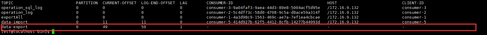

= ETF相关文档
song jl
:doctype: article
:encoding: utf-8
:lang: en
:toc: left
:numbered:

== 开发规范
=== 增加字段流程
* 代码需要增加字段：

  param/queryParam/vo/entity/queryBean/xml
  
* 实体类之间的转换需要增加方法，特别注意字段类型之间的变化

[TIP]
====
注意：基金信息、销售商信息、基金销售商信息、参数信息需要发布的功能
==== 

* 增加字段的脚本规范

=== 前后端接口联调字段定义规范
* 驼峰形式
* 数值类型的区间使用min/max开头：minShares/maxShares
* 数组格式的字段定义皆以List结尾：statusList
* 日期区间格式的传参为数组格式，命名以DateList结尾，例如：changeDateList，后台处理为两个字段：startChangeDate/endChangeDate
* 数据字典的翻译字段为xxx_text命名,例：status_text
* 页面普通查询如果包含多个含义的，使用字段keyCode，单个字段的查询，如果是模糊查询需要加上后缀Fuzzy，例：销售商名称/代码——keyCode，销售商名称（模糊）——agencyNameFuzzy，销售商代码（精准）——agencyCode
* 前后台数据交互都为字符串，日期、金额等需要格式化都由前端方法统一处理，**后台返回的数据需要做精度处理**

== 账户登记

=== 账户相关字典

[width="100%",options="header"]
|====================
| 字典名称 | 字典代码 | 值域 |  备注
| 个人证件类别 | identitytype_per |  |  略
| 机构证件类别 | identitytype_org |  |  略
| 产品证件类别 | identitytype_prod |  |  略
| 账户状态 | acco_status | normal-正常；freeze-冻结；logout-销户 |  
| 交易账号状态 | trade_accoflag | open-开户；register-登记；cancel_register-取消登记 | 
| 客户类别 | cust_type | 0-机构；1-个人；2-产品 |  
| 性别 | sex | 0-女；1-男；2-其他 | 
|====================

=== 账户相关参数
[width="100%",options="header"]
|====================
| 参数名称 | 参数代码 | 值域 | 备注  
| 更新全部客户信息 | update_cust_info_all |  | 
|====================

=== 账户登记处理逻辑
==== 处理上海模式数据 
* 将持有人名册（**cyrmc**）数据批量转移到账户申请表（**acco_request**）
   
   方法：accoRequestMapper.insertBatchByCyrmc

*查询条件*
[source,sql]
----
    select 
      ······
    from cyrmc a
         left join cust_info b on a.zqzh = b.custno
    where NVL(a.qylb,'**') ! = 'HL'
          and NVL(A.LTLX, '0') in ('N', '0')
          and b.custno is null
          and a.IMPORT_DATE = #{sysDate,jdbcType=VARCHAR}
          and a.DATA_IS_DEALED = '0'
----

* 上海担保账户的处理 
  
  方法：accoRequestMapper.insertBatchShAssureAccoByCyrmc
  
*查询条件* 
[source,sql]
----
    SELECT 
      ······
    FROM (SELECT DISTINCT A.ZDXW  AS NETNO,
                                A.ZQZH2 AS TRADEACCO,
                                A.ZQZH2 AS CUSTNO,
                                A.ZQZH2 AS FUNDACCO,
                                TRIM(A.TZRMC2) AS CUSTNAME,
                                A.ZJLB2 AS IDENTITYTYPE,
                                A.ZJDM2 AS IDENTITYNO
                  FROM CYRMC A
                  LEFT JOIN CUST_INFO B
                    ON A.ZQZH2 = B.CUSTNO
                 WHERE NVL(A.QYLB, '**') ! = 'HL'
                   AND NVL(A.LTLX, '0') IN ('N', '0')
                   AND B.CUSTNO IS NULL
                   AND A.IMPORT_DATE = #{sysDate,jdbcType=VARCHAR}
                   AND A.DATA_IS_DEALED = '0'
                   AND A.ZQZH2 IS NOT NULL) T
----

==== 处理深圳模式数据 
* 将管理人账户（**glrzh**）数据转移至账户申请表（**acco_request**） 
  
  方法：accoRequestMapper.insertBatchByGlrzh 
  
*查询条件*
[source,sql]
----
    select
      ······              
    from glrzh A
    where  A.DATA_IS_DEALED = '0'
           and not exists(select 1 from glrzh b where b.ZHFSRQ>A.ZHFSRQ and b.ZHZQZH=A.ZHZQZH)
           and not exists(select 1 from ACCO_REQUEST c where c.CUSTNO=A.ZHZQZH)
----

* 插入深圳对账库中未登记的账户，防止未知情况下账户未登记

  方法：accoRequestMapper.insertBatchGlrmx 
  
*查询条件* 
[source,sql]
----
    SELECT 
      ······
    FROM (select MXZQZH,max(MXTGDY) MXTGDY from GLRMX group by MXZQZH) A,
             cust_info B,
             GLRZH C
    WHERE A.MXZQZH = B.CUSTNO(+)
          AND A.MXZQZH = C.ZHZQZH(+)
          AND B.CUSTNO IS NULL
          AND C.ZHZQZH IS NULL
----

  
==== 处理空数据
==== 更新认购期的销售商代码和席位
==== 处理未知席位
==== 处理未知销售商 

== 份额登记

